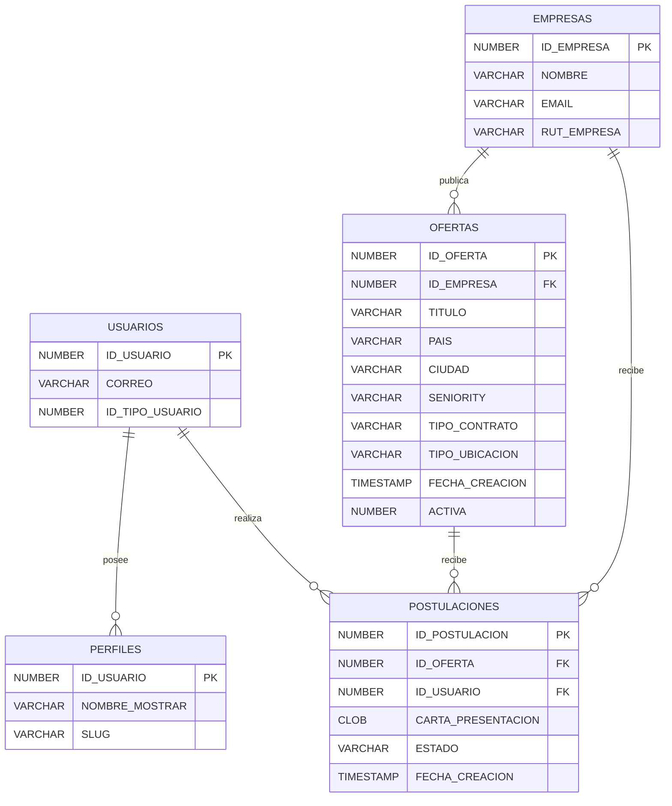

# Modelo relacional de ofertas y postulaciones

El modelo de base de datos para el módulo de empleos gira en torno a cinco
entidades principales. El siguiente diagrama ER resume cómo se relacionan entre
sí los usuarios, las empresas y las postulaciones:

Las claves foráneas más relevantes son:

* `OFERTAS.ID_EMPRESA` → `EMPRESAS.ID_EMPRESA`
* `POSTULACIONES.ID_OFERTA` → `OFERTAS.ID_OFERTA`
* `POSTULACIONES.ID_USUARIO` → `USUARIOS.ID_USUARIO`
* `PERFILES.ID_USUARIO` → `USUARIOS.ID_USUARIO`

Esta visualización sirve como guía para validar las restricciones de
pertenencia antes de crear o modificar procedimientos PL/SQL, asegurando que
los cambios mantengan la integridad referencial del módulo.
