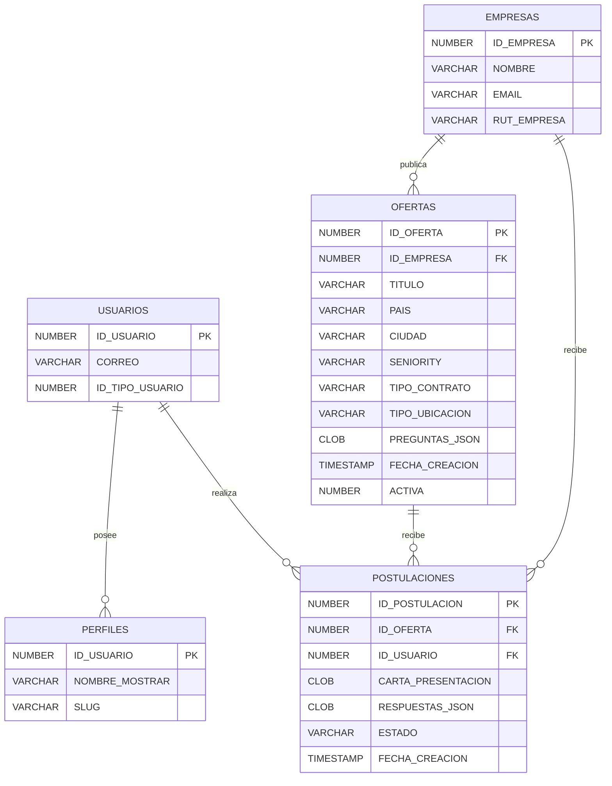

# Modelo relacional de ofertas y postulaciones

El modelo de base de datos para el módulo de empleos gira en torno a cinco
entidades principales. El siguiente diagrama ER resume cómo se relacionan entre
sí los usuarios, las empresas y las postulaciones:

Las claves foráneas más relevantes son:

* `OFERTAS.ID_EMPRESA` → `EMPRESAS.ID_EMPRESA`
* `POSTULACIONES.ID_OFERTA` → `OFERTAS.ID_OFERTA`
* `POSTULACIONES.ID_USUARIO` → `USUARIOS.ID_USUARIO`
* `PERFILES.ID_USUARIO` → `USUARIOS.ID_USUARIO`

Esta visualización sirve como guía para validar las restricciones de
pertenencia antes de crear o modificar procedimientos PL/SQL, asegurando que
los cambios mantengan la integridad referencial del módulo.

## Campos JSON validados por `sp_empresas_pkg`

* `OFERTAS.PREGUNTAS_JSON` almacena las preguntas configurables de cada oferta
  (hasta tres) y su bandera `obligatorio`. Solo se debe poblar mediante
  `sp_empresas_pkg.sp_crear_oferta`, que valida la estructura del JSON antes de
  persistirlo.
* `POSTULACIONES.RESPUESTAS_JSON` guarda las respuestas proporcionadas por los
  postulantes y se escribe exclusivamente a través de
  `sp_empresas_pkg.sp_postular_oferta`, manteniendo alineados los formatos.

> **Importante:** cualquier inserción o actualización de preguntas y respuestas
> debe utilizar los procedimientos `sp_empresas_pkg` para preservar la
> integridad del modelo y evitar JSON incompletos o con demasiadas entradas.

En `server/sql/model/test_sp_empresas_crear.sql` y
`server/sql/model/test_sp_empresas_postular.sql` encontrarás ejemplos listos
para ejecutar que validan tanto los escenarios exitosos como los que deben
fallar por violar las reglas anteriores.
