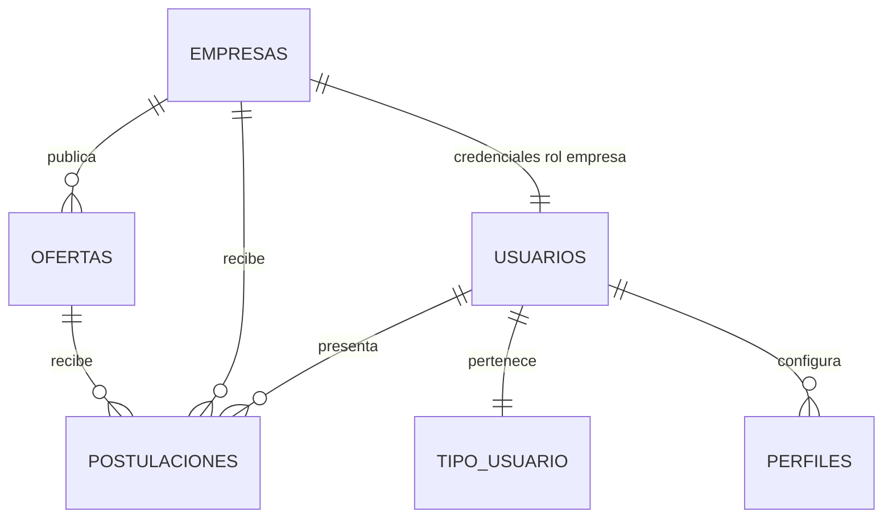

# Modelo entidad-relación de empleos antes de nuevos cambios

El siguiente diagrama resume cómo se enlazan las entidades clave del módulo de empleos con los roles de usuario. Sirve para validar que las operaciones expuestas por `sp_empresas_pkg` respetan las dependencias existentes antes de modificar o agregar procedimientos PL/SQL.

* **Usuarios/Rol**: `TIPO_USUARIO` mantiene los roles. El paquete `sp_empresas_pkg` asegura la existencia del rol Empresa (`c_tipo_usuario_empresa`) antes de registrar compañías, por lo que la autenticación de empresa se apoya en `USUARIOS` + `TIPO_USUARIO`.
* **Empresa**: `sp_registrar_empresa` crea la compañía y amarra sus credenciales al usuario creado. Las ofertas (`OFERTAS`) siempre referencian a la empresa mediante `ID_EMPRESA`.
* **Empleo (Oferta)**: `sp_crear_oferta` genera registros en `OFERTAS` y valida el JSON de preguntas (`PREGUNTAS_JSON`) respetando el máximo de tres entradas indicado en el paquete. `sp_actualizar_estado_oferta` y `sp_eliminar_oferta` operan sobre esta entidad manteniendo la pertenencia por empresa.
* **Postulación**: `sp_postular_oferta` inserta en `POSTULACIONES` atando usuario y oferta. `sp_actualizar_estado_postulacion` y `sp_listar_postulantes(_oferta)` usan estas claves para validar la empresa dueña de la oferta antes de cambiar estados o listar.
* **Listados y resúmenes**: `sp_listar_ofertas_publicas`, `sp_listar_ofertas_empresa` y `sp_resumen_postulaciones_empresa` leen `OFERTAS` y `POSTULACIONES`, respetando las relaciones anteriores para devolver solo registros válidos.

Esta visualización confirma que las operaciones actuales de `sp_empresas_pkg` ya cumplen con las dependencias entre usuario/rol, empresa y postulaciones, por lo que cualquier ajuste futuro debe preservar estas claves foráneas y los límites de validación definidos en el paquete.
